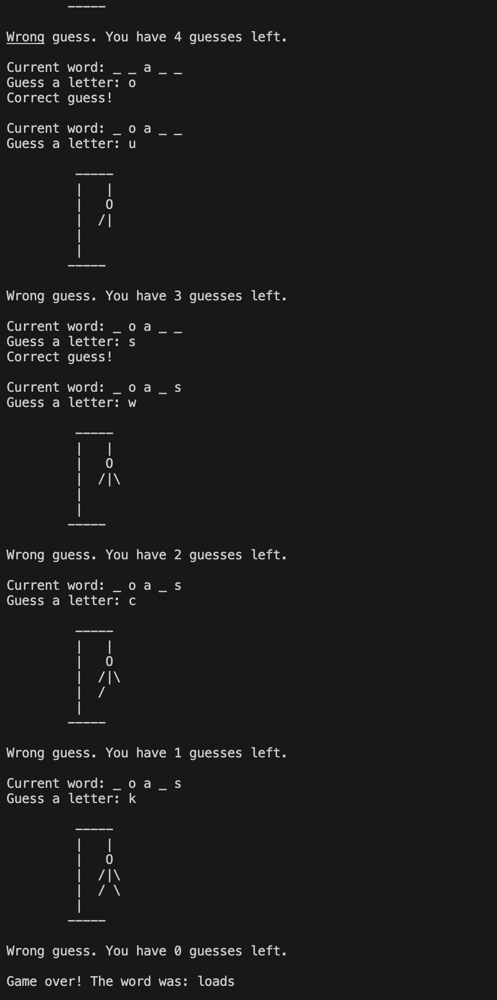

# Stage 0: Initial state (no incorrect guesses)
#  -----
#  |   |
#  |
#  |
#  |
#  |
# -----

# Stage 1: First incorrect guess
#  -----
#  |   |
#  |   O
#  |
#  |
#  |
# -----

# Stage 2: Second incorrect guess
#  -----
#  |   |
#  |   O
#  |   |
#  |
#  |
# -----

# Stage 3: Third incorrect guess
#  -----
#  |   |
#  |   O
#  |  /|
#  |
#  |
# -----

# Stage 4: Fourth incorrect guess
#  -----
#  |   |
#  |   O
#  |  /|\
#  |
#  |
# -----

# Stage 5: Fifth incorrect guess
#  -----
#  |   |
#  |   O
#  |  /|\
#  |  /
#  |
# -----

# Stage 6: Sixth incorrect guess (final stage, game over)
#  -----
#  |   |
#  |   O
#  |  /|\
#  |  / \
#  |
# -----

